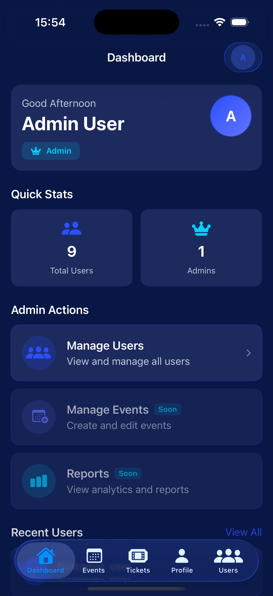
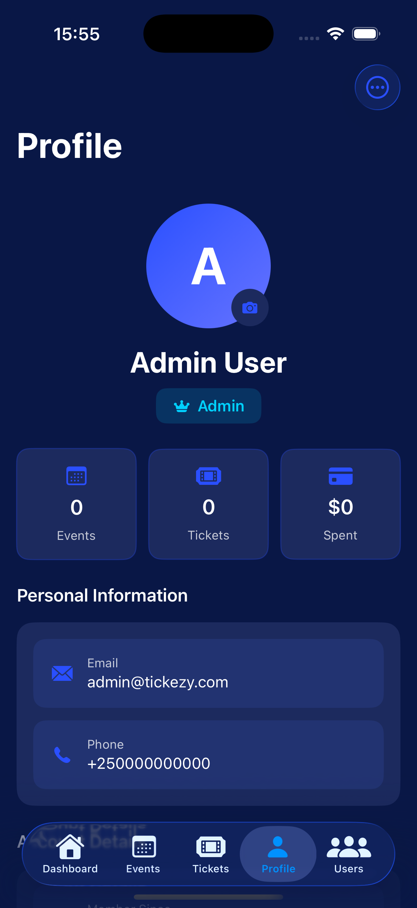
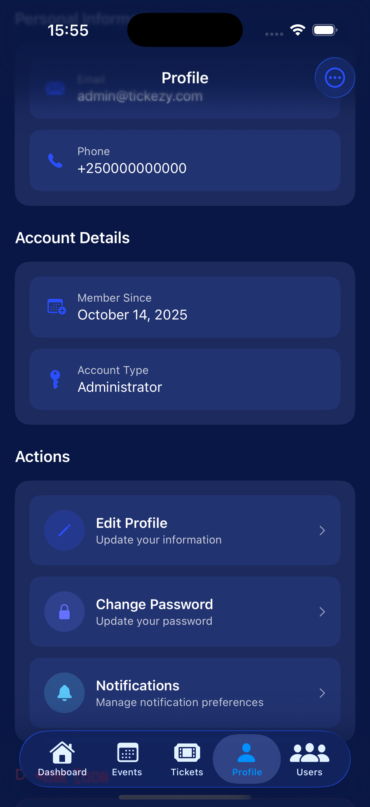
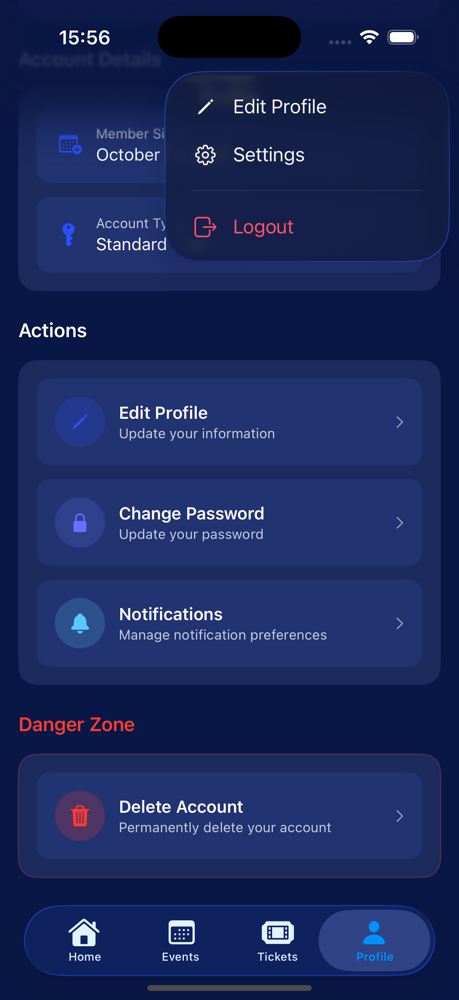

# Tickezy Fullstack

**Tickezy** is a mobile ticketing platform that allows users to browse, purchase, and manage event tickets securely.  
This repository contains both the **Node.js backend** and **Swift iOS frontend**.

---

## Table of Contents
- [Features](#features)
- [Tech Stack](#tech-stack)
- [Frontend](#frontend)
- [Backend Installation](#backend-installation)
- [Backend Environment Variables](#backend-environment-variables)
- [Database Setup](#database-setup)
- [Running the Backend](#running-the-backend)
- [API Documentation](#api-documentation)
- [iOS Frontend Setup](#ios-frontend-setup)
- [Project Structure](#project-structure)
- [Contributing](#contributing)
- [License](#license)

---

## Features
- User registration and login with JWT authentication
- Password hashing with bcrypt
- Role-based access control (Admin / Customer)
- User profile management
- Admin-only routes
- Ticket browsing and purchase (via iOS frontend)
- Swagger API documentation
- PostgreSQL database integration via Sequelize ORM

---

## Tech Stack
- **Backend:** Node.js, Express.js, PostgreSQL, Sequelize ORM  
- **Authentication:** JWT, Bcrypt  
- **API Docs:** Swagger (swagger-jsdoc + swagger-ui-express)  
- **Frontend:** Swift (SwiftUI) for iOS  
- **Other:** CORS, dotenv

---

## Frontend

The iOS app is built with **SwiftUI** and connects to the backend via REST API endpoints.  
Features include:  

- Browse and search events
- Purchase tickets
- View and manage user profile
- Admin features (if logged in as admin)

The Swift project is located in the `TICKEZY` folder.


# Screenshot 







---

## Backend Installation

Clone the repository and navigate to the backend folder:

```bash
git clone https://github.com/andremugabo/tickezy_app_swift_nodejs.git
cd tickezy_backend
````

Install dependencies:

```bash
npm install
```

---

## Backend Environment Variables

Create a `.env` file in `tickezy_backend/`:

```env
# Server
PORT=3000
NODE_ENV=development

# Database (PostgreSQL)
DB_HOST=localhost
DB_PORT=5432
DB_USER=postgres
DB_PASSWORD=your_db_password
DB_NAME=tickezyApp_db
DB_DIALECT=postgres

# JWT
JWT_SECRET=your_jwt_secret
JWT_EXPIRES_IN=1d

# Other settings
UPLOAD_FOLDER=uploads
```

---

## Database Setup

1. Ensure PostgreSQL is installed and running.
2. Create the database:

```sql
CREATE DATABASE tickezyApp_db;
```

3. Sequelize will sync models automatically when the backend starts.

> ⚠️ Make sure your `User` model includes all required columns (`id`, `email`, `name`, `password`, `role`, `phoneNumber`, etc.).

---

## Running the Backend

Start the development server:

```bash
npm run dev
```

Backend will run at `http://localhost:3000`.

---

## API Documentation

Swagger API documentation is available at:

```
http://localhost:3000/api-docs
```

Endpoints include:

* `POST /api/users/register` - Register a new user
* `POST /api/users/login` - Log in
* `GET /api/users/profile` - Get logged-in user's profile
* `GET /api/users/all` - Get all users (Admin only)

---

## iOS Frontend Setup

1. Open the Swift project:

```bash
cd TICKEZY
open TICKEZY.xcodeproj
```

2. In Xcode, select your target device or simulator.
3. Update the API base URL in your Swift code if necessary:

```swift
let baseURL = "http://localhost:3000/api"
```

4. Build and run the app in the simulator or a connected device.

> ⚠️ Make sure the backend is running before using the app to fetch data.

---

## Project Structure

```
TICKEZY_FULLSTACK/
│
├── tickezy_backend/        # Node.js backend
│   ├── src/
│   │   ├── controller/
│   │   ├── models/
│   │   ├── routes/
│   │   ├── services/
│   │   └── middleware/
│   ├── db.js
│   ├── server.js
│   ├── swagger.js
│   ├── package.json
│   └── .env
│
└── TICKEZY/                # Swift iOS frontend
    ├── TICKEZY.xcodeproj
    ├── TICKEZYApp.swift
    ├── ContentView.swift
    ├── Assets.xcassets
    ├── TICKEZYTests/
    └── TICKEZYUITests/
```

---

## Contributing

1. Fork the repository
2. Create a new branch (`git checkout -b feature/your-feature`)
3. Commit your changes (`git commit -m 'Add feature'`)
4. Push to the branch (`git push origin feature/your-feature`)
5. Open a Pull Request

---

## License

This project is licensed under the **MIT License**.


